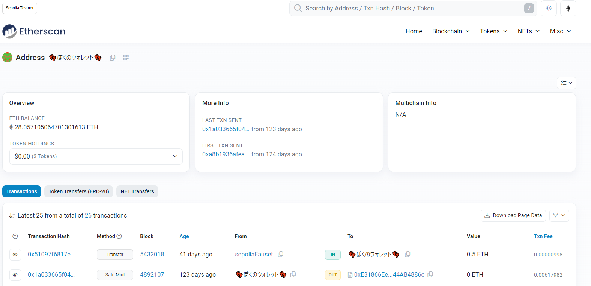

# Sepolia Etherscan用拡張機能 【アドレスを任意文字列で表示する】

## こんな感じで表示

## TODO

### 機能実装

- [ ] 表示切り替え機能の実装
- [ ] 登録しているエイリアスの一覧表示
- [ ] 特定のエイリアスを指定して削除する機能

### UI/デザイン

- [ ] エイリアス登録時に登録した旨の表示
- [ ] 削除時の警告表示

### 内部設計

- [ ] HTMLを文字列にして置換する"脳筋置換"から脱却

### その他
  
## インストール方法

googlechromeで利用可能．
git cloneしてそのまま，「パッケージ化されていない拡張機能を読み込む」で行ける．